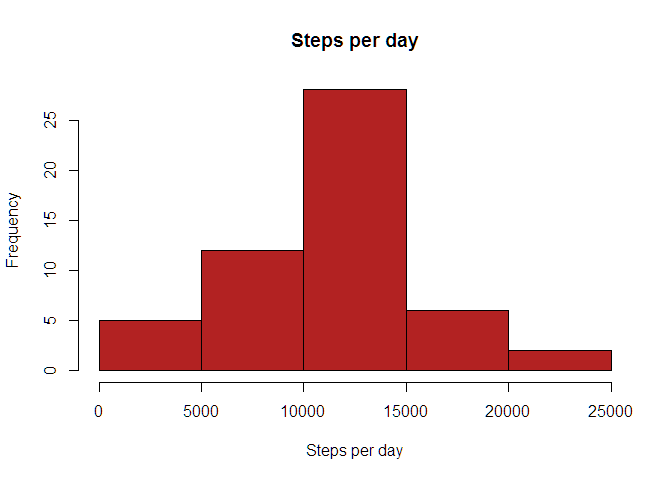
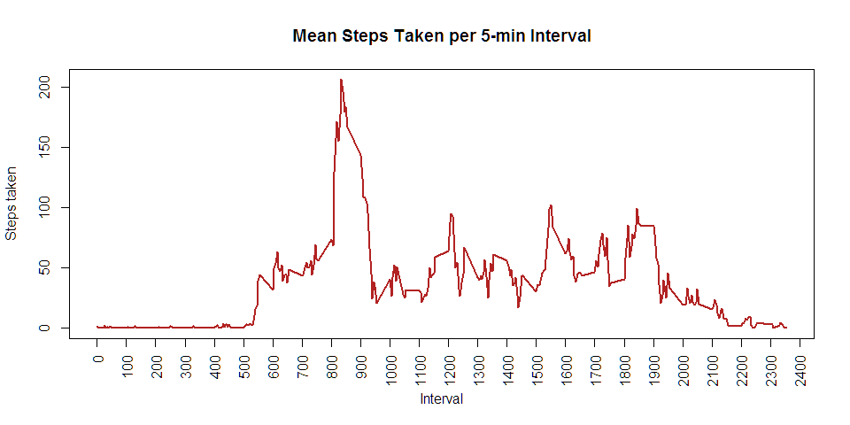
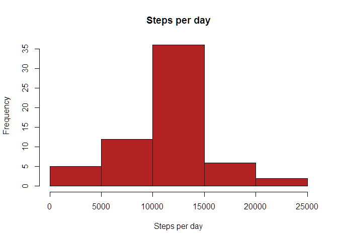
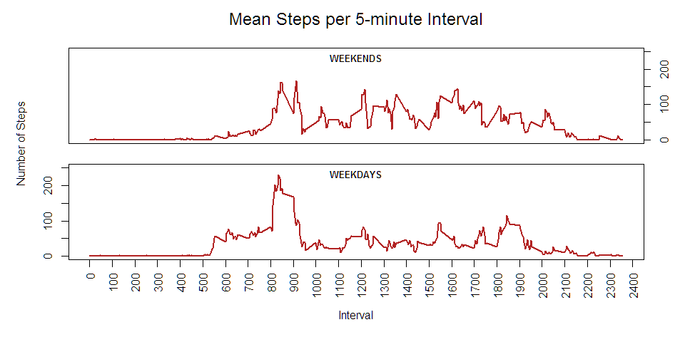

# Reproducible Research: Peer Assessment 1
Edward Cox  


## Loading and preprocessing the data


```r
d <- read.table(unz("activity.zip", "activity.csv"), header = TRUE, sep = ",", 
                colClasses = c("integer", "character", "integer"))

d$date <- as.Date(d$date)
```


## What is mean total number of steps taken per day?

```r
# Calc total steps per day.  Ignore rows containing NA.
steps.per.day <- tapply(d[complete.cases(d), "steps"], d[complete.cases(d), "date"], sum)

# Create histogram of steps per day
hist(steps.per.day, main = "Steps per day", xlab = "Steps per day", col = "firebrick")
```

<!-- -->

```r
# Report mean and median
summary(steps.per.day, digits = 5)
```

```
##    Min. 1st Qu.  Median    Mean 3rd Qu.    Max. 
##      41    8841   10765   10766   13294   21194
```


## What is the average daily activity pattern?

```r
# Time series plot of average number of steps taken per interval
steps.per.interval <- tapply(d$steps, d$interval, mean, na.rm = TRUE)
plot(names(steps.per.interval), steps.per.interval, type = "l", 
     xaxt = "n", lwd = 2, col = "firebrick",
     main = "Mean Steps Taken per 5-min Interval", xlab = "Interval", ylab = "Steps taken")
axis(1, at = seq(0, 2400, by = 100), las = 2)
```

<!-- -->

```r
# Which interval contains max # of steps?
names(which.max(steps.per.interval))
```

```
## [1] "835"
```


## Imputing missing values

```r
# How many rows contain missing values?
sum(!complete.cases(d))
```

```
## [1] 2304
```

```r
# Clone dataset
d2 <- d

# Using new dataset, replace any NA's in "steps" col with mean for that interval across all days
d2[which(is.na(d$steps)),]$steps <- steps.per.interval[as.character(d[which(is.na(d$steps)),]$interval)]

# Using new dataset, calculate total steps per day.
steps.per.day2 <- round(tapply(d2$steps, d2$date, sum))

# Using new dataset, create a histogram of steps per day
hist(steps.per.day2, main = "Steps per day", xlab = "Steps per day", col = "firebrick")
```

<!-- -->

```r
# Using new dataset, report mean and median of steps
summary(steps.per.day2, digits = 5)
```

```
##    Min. 1st Qu.  Median    Mean 3rd Qu.    Max. 
##      41    9819   10766   10766   12811   21194
```

```r
# Difference in mean, median between original and imputed data sets?
matrix(round(c(mean(steps.per.day), median(steps.per.day), mean(steps.per.day2), median(steps.per.day2))), 
       nrow = 2, dimnames = list(c("mean","median"), c("Not Imputed","Imputed")))
```

```
##        Not Imputed Imputed
## mean         10766   10766
## median       10765   10766
```


## Are there differences in activity patterns between weekdays and weekends?

```r
# Create weekday and weekend cols
wd <- weekdays(d2$date) %in% c("Saturday", "Sunday")
d2$weekpart <- factor(wd, labels = c("weekday", "weekend"))

# Create panel plot of mean steps per interval on weekdays vs. weekends
# Time series plot of average number of steps taken per interval
steps.per.interval.weekdays <- tapply(d2[d2$weekpart == "weekday", "steps"], 
                                      d2[d2$weekpart == "weekday", "interval"], 
                                      mean, na.rm = TRUE)

steps.per.interval.weekends <- tapply(d2[d2$weekpart == "weekend", "steps"], 
                                      d2[d2$weekpart == "weekend", "interval"], 
                                      mean, na.rm = TRUE)

par(mfrow = c(2, 1), mar = c(0, 0, 1.5, 0), oma = c(6, 5, 2, 3), xpd = NA)

plot(names(steps.per.interval.weekends), steps.per.interval.weekends, type = "l", 
     xaxt = "n", yaxt = "n", lwd = 2, col = "firebrick",
     xlab = "", ylab = "", ylim = c(0, 250))
title("WEEKENDS", line = -1, cex.main = .8)
axis(4)

plot(names(steps.per.interval.weekdays), steps.per.interval.weekdays, type = "l", 
     xaxt = "n", lwd = 2, col = "firebrick",
     xlab = "", ylab = "", ylim = c(0, 250))
title("WEEKDAYS", line = -1, cex.main = .8)
axis(1, at = seq(0, 2400, by = 100), las = 2)

mtext("Mean Steps per 5-minute Interval", side = 3, outer = TRUE, cex = 1.5, line = 0)
mtext("Interval", side = 1, outer = TRUE, cex = 1, line = 3.5)
mtext("Number of Steps", side = 2, outer = TRUE, cex = 1, line = 3)
```

<!-- -->
